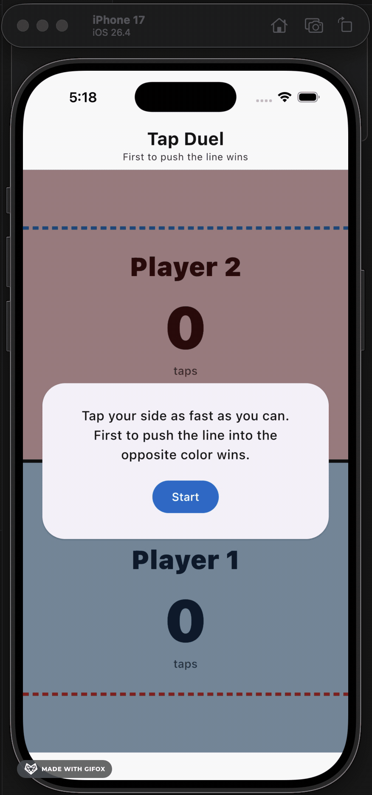
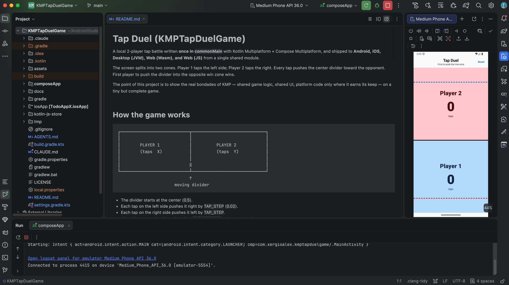

# Tap Duel (KMPTapDuelGame)

A local 2-player tap battle written **once in `commonMain`** with Kotlin Multiplatform + Compose Multiplatform, and shipped to **Android, iOS, Desktop (JVM), Web (Wasm), and Web (JS)** from a single shared module.

The screen splits into two zones. Player 1 taps the left side; Player 2 taps the right. Every tap pushes the center divider toward the opponent. First player to push the divider into the opposite win zone wins.

The point of this project is to show the real bondades of KMP — shared game logic, shared UI, platform code only where it earns its keep — on a tiny but complete game.

<p align="center">
  
</p>



## How the game works

```
┌────────────────────────────┬──────────────────────────────┐
│                            │                              │
│        PLAYER 1            │          PLAYER 2            │
│        (taps  X)           │          (taps  Y)           │
│                            │                              │
│                            ‖                              │
└────────────────────────────┴──────────────────────────────┘
                             ↑
                       moving divider
```

- The divider starts at the center (`0.5`).
- Each tap on the left side pushes it right by `TAP_STEP` (`0.02`).
- Each tap on the right side pushes it left by `TAP_STEP`.
- After **20 net taps** in either direction (`TAPS_TO_WIN`), the round ends.
- A winner overlay appears with final tap counts and a *Play again* button.

The game itself is in-memory only — no save state, no backend, no accounts.

## Features

- Pure-Kotlin game engine in `commonMain` (`game/TapDuelGame.kt`) with full unit tests in `commonTest`
- Multiplatform `ViewModel` (androidx-lifecycle 2.10) holds the `StateFlow<TapDuelState>` and the `3 · 2 · 1 · GO!` countdown
- `pointerInput { awaitEachGesture { awaitFirstDown() } }` so every press counts on touch and mouse — no missed rapid taps
- Adaptive layout — horizontal split on tablet/desktop/web (≥ 600 dp), vertical split on phones held portrait
- Material 3 theming with a cool/warm palette mapped to `colorScheme.primary` / `colorScheme.error` so dark mode works out of the box
- i18n EN + ES via Compose Multiplatform resources; locale follows the system
- Demonstrates `expect/actual` with `Platform.kt`, even though the game itself doesn't need a platform bridge

## Architecture at a glance

```
commonMain
  ├── game/                  Pure engine: Player, GameStatus, TapDuelState, TapDuelGame
  ├── ui/
  │   ├── TapDuelScreen.kt   Split arena, divider, counters, controls, overlays
  │   ├── TapDuelViewModel.kt  StateFlow + viewModelScope countdown
  │   └── theme/AppTheme.kt    Material 3 light/dark schemes
  └── App.kt                  AppTheme { TapDuelScreen() }

androidMain  → MainActivity sets content { App() }
iosMain      → MainViewController() returns ComposeUIViewController { App() }
jvmMain      → application { Window { App() } }
webMain      → ComposeViewport { App() } (shared by JS + Wasm)
```

- All UI, the ViewModel, and the engine live in `commonMain` — no per-platform clones.
- Platform source sets contain only the entry-point glue and a tiny `Platform.kt` `expect/actual` demo.
- No `nonWebMain`, no SQL, no settings storage — the game is intentionally simple.

See [App Overview](docs/APP_OVERVIEW.md) and [Architecture](docs/ARCHITECTURE.md) for the long version.

## Tech stack

| What | Version | Why |
|---|---|---|
| **Kotlin Multiplatform** | 2.3.20 | Shared language across all targets |
| **Compose Multiplatform** | 1.10.3 | Shared declarative UI on every target |
| **Material 3** | 1.10.0-alpha05 | Design system, theming, animations |
| **AndroidX Lifecycle (KMP)** | 2.10.0 | `ViewModel` + `viewModelScope` in `commonMain` |
| **kotlinx-coroutines** | 1.10.2 | Backs the countdown timer |
| **Compose Hot Reload** | 1.0.0 | Live reload while iterating on Desktop |

Full catalog with rationale: [docs/TECHNOLOGIES.md](docs/TECHNOLOGIES.md).

## Quick start

> ⚠️ Use **Java 21** for Gradle. The bundled Kotlin compiler in Gradle 8.14 doesn't yet handle newer JDKs. On macOS:
> ```bash
> export JAVA_HOME="/Library/Java/JavaVirtualMachines/temurin-21.jdk/Contents/Home"
> ```
> When you run from Android Studio's Run config, the IDE supplies its own JDK and you don't need this export.

```bash
./gradlew :composeApp:run                              # Desktop (with Compose Hot Reload)
./gradlew :composeApp:installDebug                     # Android (needs an emulator/device)
./gradlew :composeApp:wasmJsBrowserDevelopmentRun      # Web (Wasm — preferred)
./gradlew :composeApp:jsBrowserDevelopmentRun          # Web (JS — legacy fallback)
# iOS: open iosApp/iosApp.xcodeproj in Xcode and ⌘R
```

Run the tests:

```bash
./gradlew :composeApp:jvmTest        # Engine tests, fastest target
./gradlew :composeApp:allTests       # All targets that support tests
```

Full command reference: [docs/DEVELOPMENT_COMMANDS.md](docs/DEVELOPMENT_COMMANDS.md).

## Getting started (new to KMP?)

If this is your first Kotlin Multiplatform project on macOS, walk these in order:

1. [`docs/getting-started/ENVIRONMENT_SETUP.md`](docs/getting-started/ENVIRONMENT_SETUP.md) — install Android Studio, Xcode, the KMP plugin, and Java 21
2. [`docs/getting-started/RUNNING_THE_APP.md`](docs/getting-started/RUNNING_THE_APP.md) — run on Android (emulator + real device), iOS (simulator + real iPhone), Desktop, and Web
3. [`docs/getting-started/TROUBLESHOOTING.md`](docs/getting-started/TROUBLESHOOTING.md) — every issue we actually hit during setup, with fixes
4. [`docs/getting-started/FLUTTER_BONUS.md`](docs/getting-started/FLUTTER_BONUS.md) — optional Flutter setup + KMP-vs-Flutter comparison

## What's inside

- `composeApp/` — the only Gradle subproject. Shared UI + engine in `commonMain`, platform entry points in `androidMain` / `iosMain` / `jvmMain` / `jsMain` / `wasmJsMain` / `webMain`
- `iosApp/` — Xcode project that consumes the `ComposeApp` framework
- `gradle/libs.versions.toml` — single version catalog (every dependency pinned here)
- `docs/` — full documentation set (see below)
- `.claude/` — Claude Code skills and agents tuned for KMP work
- `AGENTS.md` — single source of truth for AI assistants (Claude, Cursor, Codex, Gemini, Copilot)

## Documentation

| Topic | File |
|---|---|
| **App overview, features, architecture** | [`docs/APP_OVERVIEW.md`](docs/APP_OVERVIEW.md) |
| Getting started (macOS, from zero) | [`docs/getting-started/`](docs/getting-started/) |
| Architecture & source sets | [`docs/ARCHITECTURE.md`](docs/ARCHITECTURE.md) |
| Stack and versions | [`docs/TECHNOLOGIES.md`](docs/TECHNOLOGIES.md) |
| Coding standards | [`docs/STANDARDS.md`](docs/STANDARDS.md) |
| Gradle commands | [`docs/DEVELOPMENT_COMMANDS.md`](docs/DEVELOPMENT_COMMANDS.md) |
| Testing | [`docs/TESTING_GUIDE.md`](docs/TESTING_GUIDE.md) |
| Per-platform notes | [`docs/PLATFORMS.md`](docs/PLATFORMS.md) |
| Build & deploy | [`docs/BUILD_DEPLOY.md`](docs/BUILD_DEPLOY.md) |
| Internationalization | [`docs/I18N_GUIDE.md`](docs/I18N_GUIDE.md) |
| Performance | [`docs/PERFORMANCE.md`](docs/PERFORMANCE.md) |
| Accessibility | [`docs/ACCESSIBILITY.md`](docs/ACCESSIBILITY.md) |
| Security | [`docs/SECURITY.md`](docs/SECURITY.md) |
| Fork rebrand checklist | [`docs/FORK_CUSTOMIZATION.md`](docs/FORK_CUSTOMIZATION.md) |
| AI agent onboarding | [`docs/AI_AGENT_ONBOARDING.md`](docs/AI_AGENT_ONBOARDING.md) |

## Project history

Bootstrapped from [`xergioalex/kmpstarter`](https://github.com/xergioalex/kmpstarter), turned into a Todo app at [`xergioalex/kmptodoapp`](https://github.com/xergioalex/kmptodoapp), then transformed into Tap Duel.

## License

Released under the [MIT License](LICENSE) — free to use, modify, and distribute.

## Credits

Bootstrapped from the JetBrains [Kotlin Multiplatform / Compose Multiplatform](https://www.jetbrains.com/help/kotlin-multiplatform-dev/get-started.html) project wizard.
